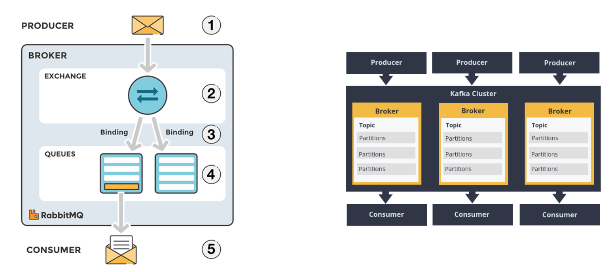

# Data Streams

## Kafka

### Installing Kafka
```
$ tar xvzf ./libs/kafka_2.12-1.0.0.tgz
```

### Starting Kafka
```
$ cd ./libs/kafka_2.12-1.0.0
$ ./bin/zookeeper-server-start.sh ./config/zookeeper.properties 
$ ./bin/kafka-server-start.sh ./config/server.properties 
```

### Stoping Kafka
```
$ cd ./libs/kafka_2.12-1.0.0
$ ./bin/kafka-server-stop.sh
$ ./bin/zookeeper-server-stop.sh
```

### Creating Topics
```
$ ./bin/kafka-topics.sh --create --zookeeper localhost:2181 --replication-factor 1 --partitions 1 --topic test
```

### Creating Producer
```
$ ./bin/kafka-console-producer.sh --broker-list localhost:9092 --topic test
> send 1st message
> send 2nd message
```

### Creating Consumer
```
$ ./bin/kafka-console-consumer.sh --bootstrap-server localhost:9092 --topic test --from-beginning
```

### Kafka vs RabbitMQ



## References

* https://www.cloudamqp.com/blog/2019-12-12-when-to-use-rabbitmq-or-apache-kafka.html